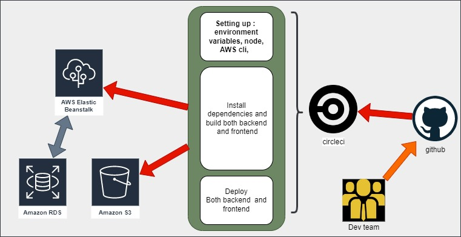

# Hosting a Full-Stack Application

## Udagram

From the root of the project:

- `npm run frontend:install`   To install frontend dependencies.
- `npm run frontend:build`     To build the Angular/Frontend.
- `npm run frontend:deploy`    To deploy the project to S3 using `./udagram-frontend/bin/deploy.sh` deploy script.
- `npm run backend:install`    To install backend dependencies.
- `npm run backend:build`      To transpile the Typescript/Backend.
- `npm run backend:deploy`     To deploy the project to EB using `./udagram-api/bin/deploy.sh` deploy script.

## pipeline

After the dev pushes to main github branch. circleci is linked to github. any change on main branch triggers circleci to rerun.

## Environment Variables Set via Circleci

### APP

PORT  

### JWT

- JWT_SECRET

### Database (RDS)

- POSTGRES_HOST
- POSTGRES_USERNAME
- POSTGRES_DB
- POSTGRES_PASSWORD

### AWS

- AWS_SECRET_ACCESS_KEY
- AWS_ACCESS_KEY_ID
- AWS_REGION
- AWS_PROFILE  
- AWS_BUCKET
- URL

## Circleci

- Configure elastic beanstalk
- Setup aws-cli
- install node and checkout code
- Install Front-End Dependencies
- Install API Dependencies
- Front-End Build
- Build API
- deploy website to s3
- deploy server to elastic beanstalk

